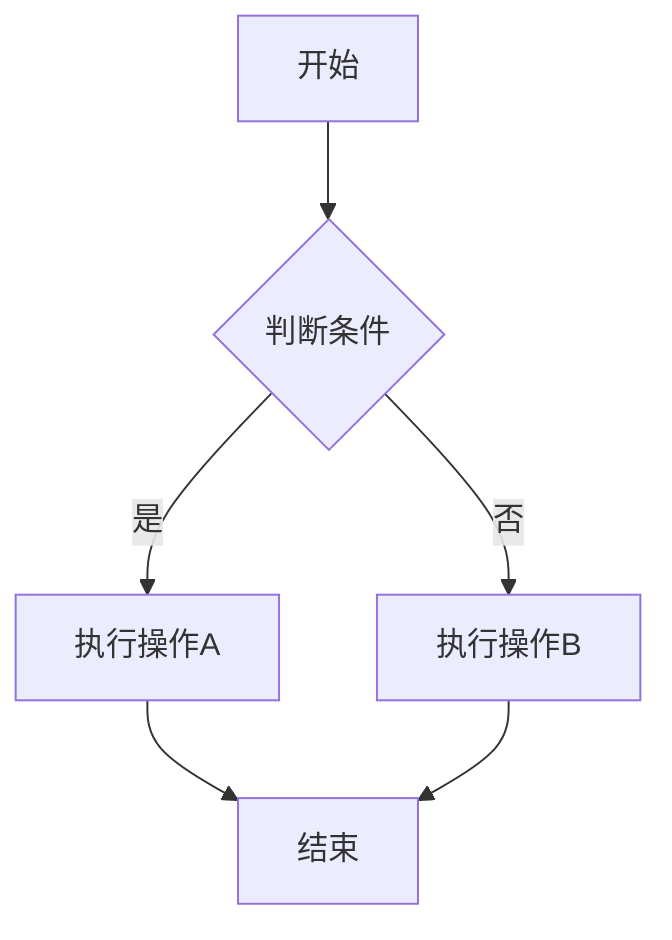
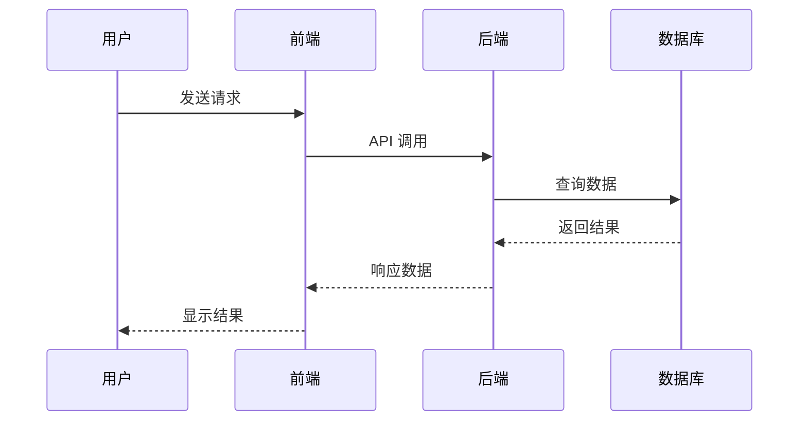
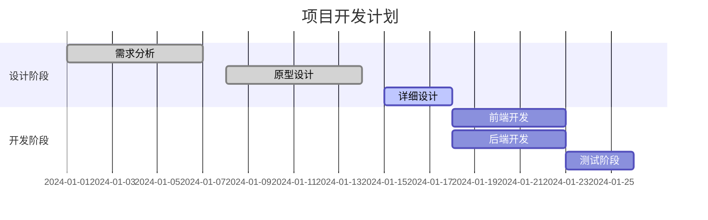

# MarkdownRender 组件

一个功能强大的 Markdown 渲染组件，支持 Mermaid 图表和 LaTeX 数学公式。

## 功能特性

- 🎯 完整的 Markdown 语法支持
- 📊 Mermaid 图表渲染（流程图、序列图、甘特图等）
- 🧮 LaTeX 数学公式支持（内联和块级）
- 🎨 代码高亮显示
- 💭 思考块支持
- ⚡ 打字机动画效果
- 🔒 安全模式 HTML 过滤
- 🎛️ 丰富的自定义配置

## 基本用法

```vue
<template>
  <MarkdownRender 
    :content="markdownContent"
    :enable-mermaid="true"
    :enable-latex="true"
    :plugin-config="pluginConfig"
  />
</template>

<script setup>
import { MarkdownRender } from '@arco-design/x'

const markdownContent = `
# 数学公式示例

内联公式：$E = mc^2$

块级公式：
$$
\\int_{-\\infty}^{\\infty} e^{-x^2} dx = \\sqrt{\\pi}
$$

# Mermaid 图表示例

\`\`\`mermaid
graph TD
    A[开始] --> B{是否登录?}
    B -->|是| C[显示主页]
    B -->|否| D[跳转登录页]
\`\`\`
`

const pluginConfig = {
  mermaid: {
    theme: 'default',
    securityLevel: 'strict',
    animate: true
  },
  latex: {
    strict: 'warn',
    trust: false,
    throwOnError: true
  }
}
</script>
```

## Props

| 参数 | 说明 | 类型 | 默认值 |
| --- | --- | --- | --- |
| content | Markdown 内容 | `string` | `''` |
| enableMermaid | 是否启用 Mermaid 支持 | `boolean` | `true` |
| enableLatex | 是否启用 LaTeX 支持 | `boolean` | `true` |
| pluginConfig | 插件配置 | `PluginConfig` | 见下方配置说明 |
| typing | 是否启用打字机效果 | `boolean` | `false` |
| typingOptions | 打字机配置 | `TypingOptions` | - |
| enableThink | 是否启用思考块 | `boolean` | `true` |
| safeMode | 是否启用安全模式 | `boolean` | `false` |
| mdOptions | markdown-it 配置 | `object` | - |
| mdPlugins | 自定义插件 | `unknown[]` | - |

## 插件配置

### Mermaid 配置

```typescript
interface MermaidPluginOptions {
  /** 主题配置 */
  theme?: 'default' | 'dark' | 'forest' | 'neutral' | 'base'
  /** 安全级别 */
  securityLevel?: 'strict' | 'loose' | 'antiscript' | 'sandbox'
  /** 是否启用动画 */
  animate?: boolean
  /** 流程图配置 */
  flowchart?: {
    nodeSpacing?: number
    rankSpacing?: number
    curve?: 'basis' | 'linear' | 'cardinal' | 'step'
  }
  /** 序列图配置 */
  sequence?: {
    width?: number
    height?: number
    boxMargin?: number
    boxTextMargin?: number
    noteMargin?: number
    messageMargin?: number
    messageAlign?: 'left' | 'center' | 'right'
  }
  /** 甘特图配置 */
  gantt?: {
    titleHeight?: number
    barHeight?: number
    fontSize?: number
    gridLineStartPadding?: number
    bottomPadding?: number
    leftPadding?: number
    gridLineInterval?: number
    arrowMarkerAbsolute?: boolean
  }
}
```

### LaTeX 配置

```typescript
interface LatexPluginOptions {
  /** 严格模式 */
  strict?: boolean | 'ignore' | 'warn' | 'error'
  /** 信任模式 */
  trust?: boolean | ((context: { command: string; url: string; protocol: string }) => boolean)
  /** 自定义宏 */
  macros?: Record<string, string>
  /** 颜色扩展 */
  colorIsTextColor?: boolean
  /** 最大展开次数 */
  maxExpand?: number
  /** 最大宏数量 */
  maxMacros?: number
  /** 全局组 */
  globalGroup?: boolean
  /** fleqn 模式 */
  fleqn?: boolean
  /** leqno 模式 */
  leqno?: boolean
  /** 抛出错误 */
  throwOnError?: boolean
  /** 错误颜色 */
  errorColor?: string
  /** 最小规则厚度 */
  minRuleThickness?: number
  /** 颜色模型 */
  colorModel?: 'rgb' | 'hsl' | 'cmyk'
}
```

## 使用示例

### Mermaid 图表

#### 流程图
````markdown

````

#### 序列图
````markdown

````

#### 甘特图
````markdown

````

### LaTeX 数学公式

#### 内联公式
```markdown
这是一个内联公式：$E = mc^2$

复杂的内联公式：$\sum_{i=1}^{n} x_i = \int_{0}^{\infty} f(x) dx$
```

#### 块级公式
```markdown
$$
\int_{-\infty}^{\infty} e^{-x^2} dx = \sqrt{\pi}
$$

$$
\begin{pmatrix}
a & b \\
c & d
\end{pmatrix}
\begin{pmatrix}
x \\
y
\end{pmatrix}
=
\begin{pmatrix}
ax + by \\
cx + dy
\end{pmatrix}
$$
```

### 思考块
```markdown
<think>
这是一个思考块，用于显示 AI 的思考过程。
可以包含多行内容。
</think>
```

### 代码块
````markdown
```javascript
function hello() {
  console.log('Hello, World!');
}
```
````

## 事件

| 事件名 | 说明 | 回调参数 |
| --- | --- | --- |
| after-mdt-init | markdown-it 初始化后 | `(md: MarkdownIt)` |
| typing-start | 打字机开始 | - |
| typing | 打字机进行中 | - |
| typing-end | 打字机结束 | - |

## 插槽

| 插槽名 | 说明 | 参数 |
| --- | --- | --- |
| table | 表格插槽 | `TableSlotProps` |
| img | 图片插槽 | `ImageSlotProps` |
| a | 链接插槽 | `LinkSlotProps` |
| code | 代码块插槽 | `CodeSlotProps` |
| think-block | 思考块插槽 | `SlotInterceptorProps` |

## 样式定制

组件使用 CSS 变量，可以通过以下方式自定义样式：

```css
.ac-markdown-content {
  --font-size-body-medium: 14px;
  --color-text-2: #333;
  --color-bg-1: #fff;
  --color-primary-6: #165dff;
  --color-fill-2: #f5f5f5;
  --border-radius-small: 4px;
  --border-radius-medium: 6px;
}
```

## 注意事项

1. **Mermaid 图表**：需要确保 Mermaid 库已正确加载
2. **LaTeX 公式**：需要确保 KaTeX 库已正确加载
3. **安全模式**：启用安全模式时会过滤 HTML 标签，确保内容安全
4. **性能考虑**：大量图表和公式可能影响渲染性能，建议适当分页
5. **错误处理**：渲染错误时会显示友好的错误信息，不会中断整个页面
